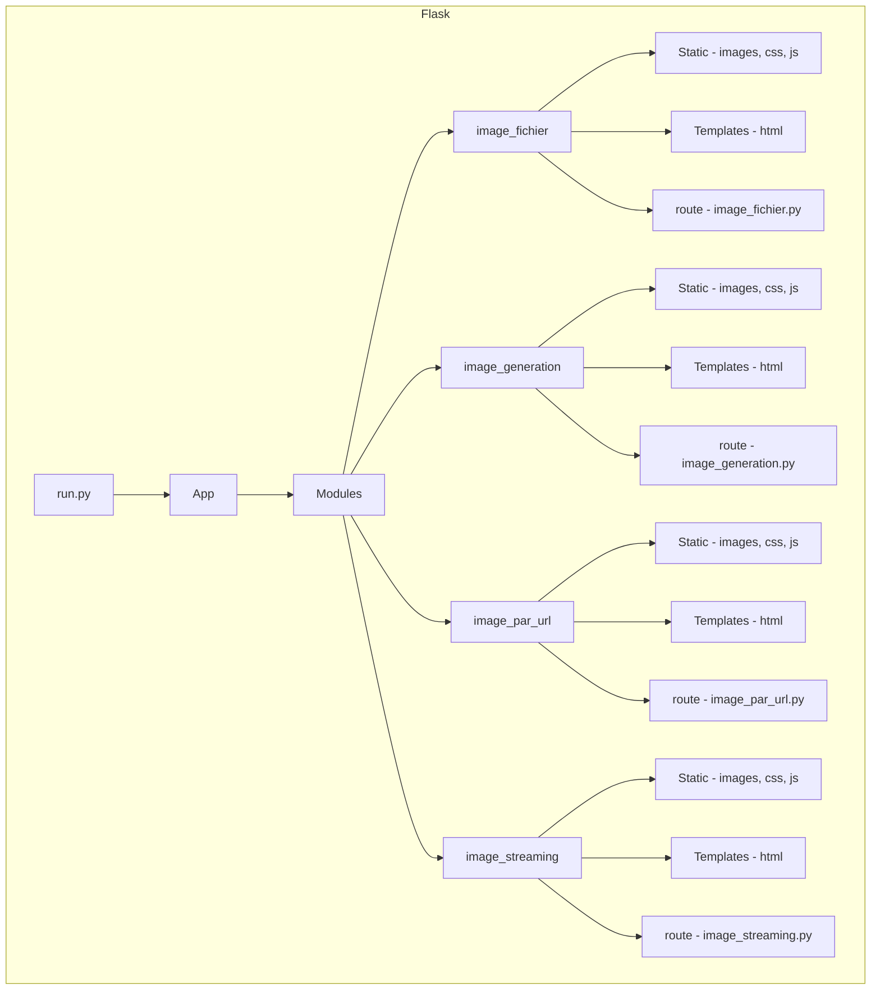

# FLASK

## Environnment virtuel

Lancer le venv à l'aide de la commande `source venv/bin/activate`

## Lancer l'application Flask

Pour cela il faut exécuter la commande `python3 run.py`
Puis il faut se connecter sur votre navigateur à l'url `http://127.0.0.1:5000`

## Schéma
